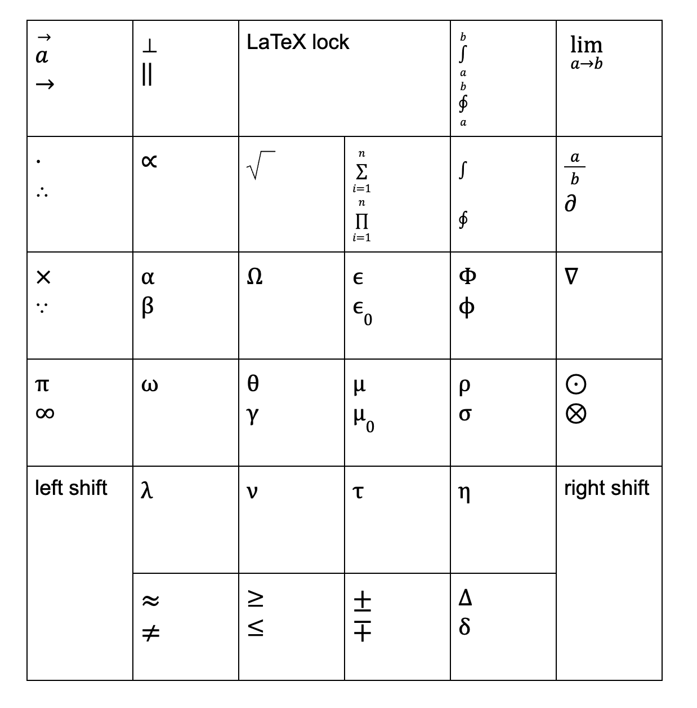

# physics-keyboard

A 33-key mechanical keyboard for writing physics and math.

## Features
- Greek letter input
- Math symbol input
- Left and right shift keys allow for >50 unique characters
- Caps Lock-like key allows switching between LaTeX and plain unicode input
- Compact square shape; similar in size to a large numpad/macropad

[BOM](bom.csv)

## Tools
- PCB design: KiCad, marbastlib
- Case and plate CAD: OnShape
- Firmware: RMK 

## Motivation
In our last years of high school, we wrote several lab reports in IB Physics which required us to input mathematical equations. We built this keyboard to make that process easier, in our classes in university.

## What we learned
Before this project, we wrote our formulae in the Google Docs equation editor. This project helped us learn LaTeX, a faster and more advanced tool than what we used previously. We also learned PCB design, including best practices for routing and design rule checking.
