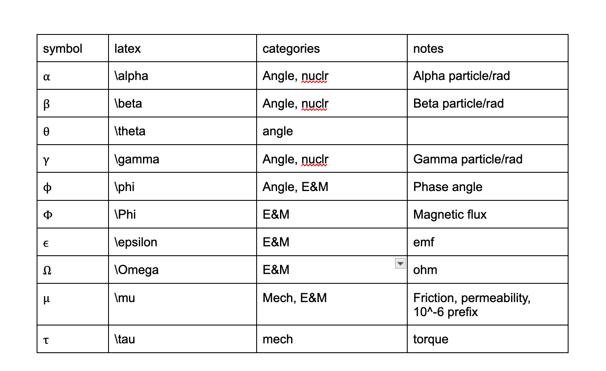
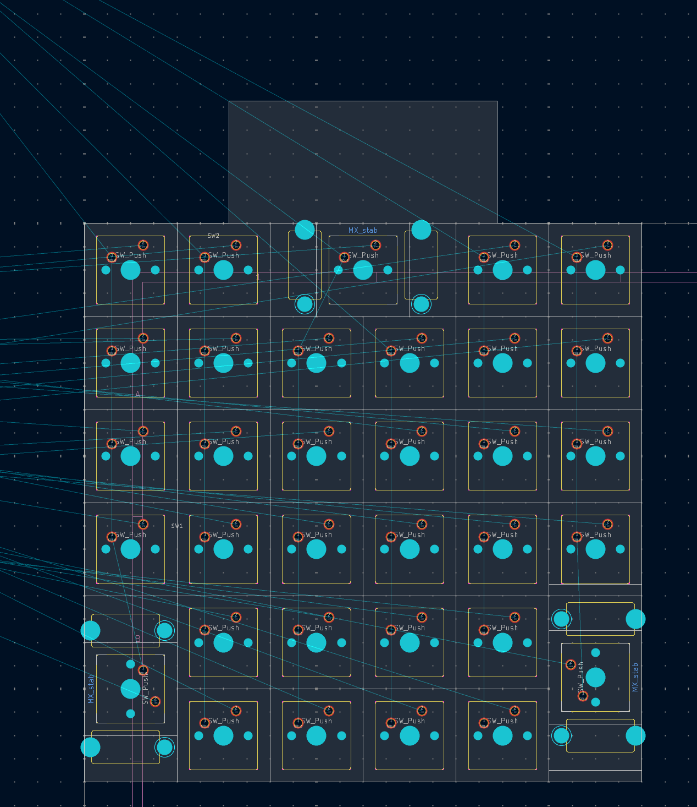
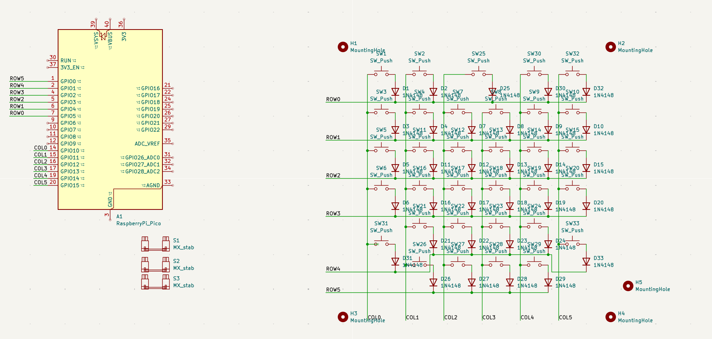
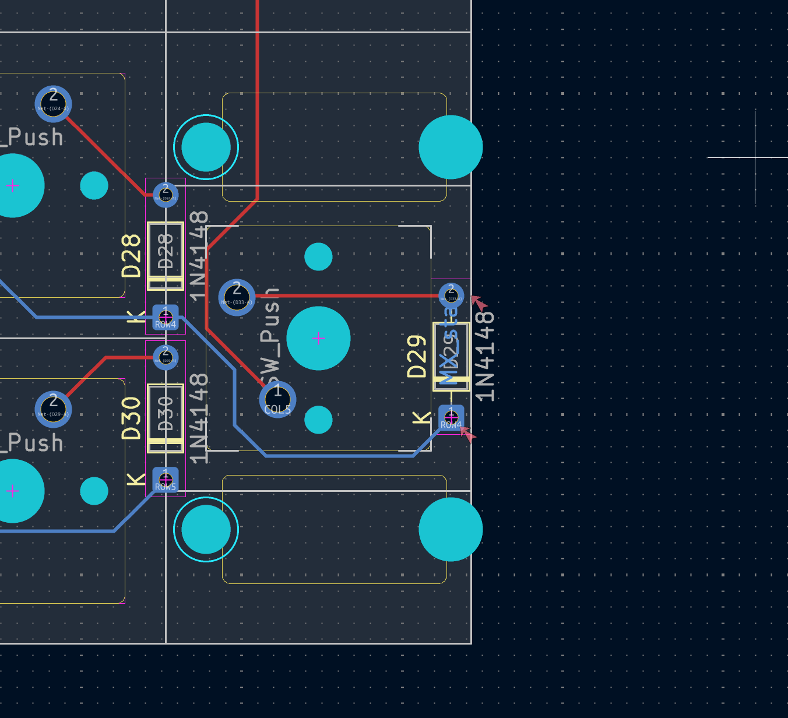
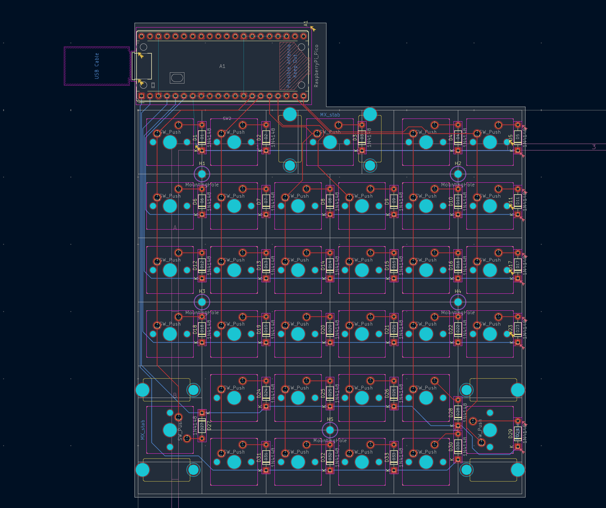
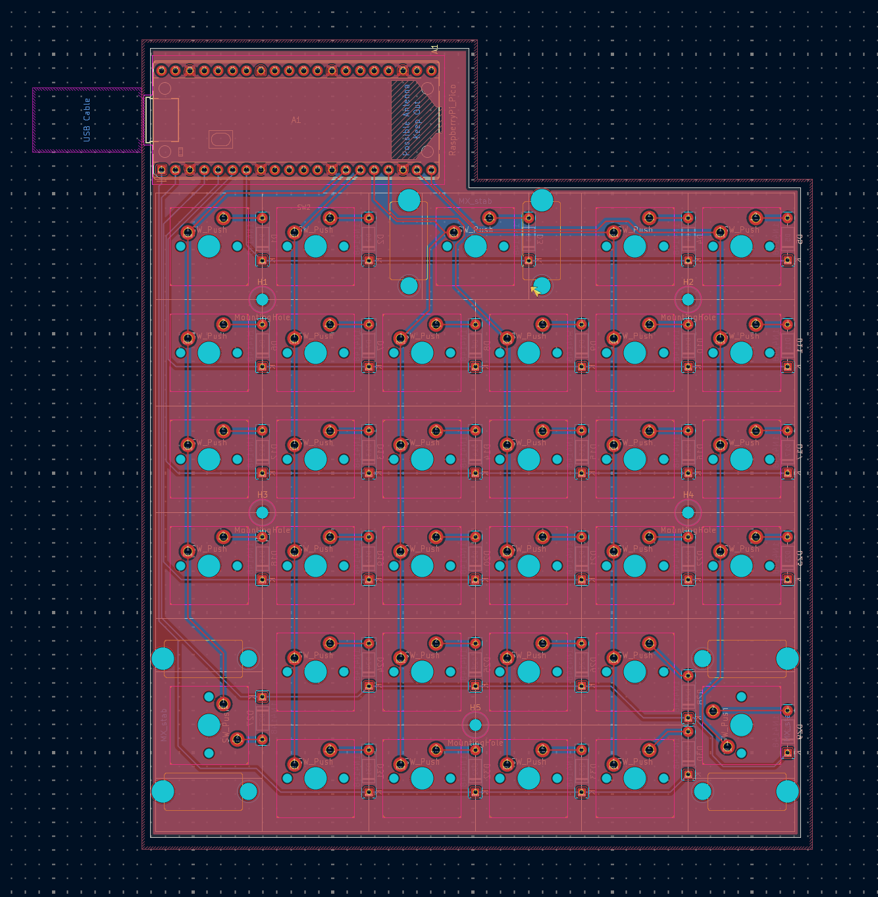

8/11 (1 hour)
Today we started brainstorming what keys we wanted to include in the keyboard. We wanted to have it be an add-on (like a macropad) to a standard keyboard, so we decided to exclude symbols (e.g. letters) that could already be typed easily. By referring to a physics formula booklet, we started building this table:

8/11 (2 hours)
A: I finished making the list of symbols. We have 43 in total. We will add two shift keys to the keyboard to reduce the amount of keys needed. I also classified each symbol so that R can arrange them so that similar symbols are clustered together. 

8/11~8/12 (2 hours)
R: came up with draft designs of the keyboard, how keys are arranged and activated. also how the keyboard itself looks like.

8/12 (2 hours)
A: set up KiCad, finished schematic and assigned footprints. The key matrix uses 12 GPIO pins for 6 cols and 6 rows.

8/12 (2 hours)
A: started working on PCB, setting the grid spacing to a factor of 19.05mm allowed alignment of keys by snapping to the grid. the PCB is square with each side being (19.05*6)mm long. A 55x25mm protrusion makes space for mounting the Pico.
Originally, the Pico was meant to be centred at the top side of the keys, but we moved it to the upper left for improved microUSB port accessibility.

8/13 (.5 hours)
We called in the morning to figure out how to add text onto keycaps in Tinkercad. We imported a blank keycap from Printables, added text and aligned the text with the keys so that the symbol is embossed on top of it

8/13~8/15 （4 hours)
R: finished cad design of key caps and keyboard with rough dimensions

8/14 (1.5 hours)
A: started routing the PCB. Adjusted pin mapping so that traces do not need to cross.
We also decided to add a right shift key and Unicode/LaTeX toggle key, expanding the keyboard to a 6x6 grid today

Schematic after pin remapping

8/17 (4 hours)
A: finished routing the PCB. Added a 1 mm margin to all sides of the PCB to fit stabilizer mounting holes. Moved the Pico slightly so that microUSB port sticks out. Added ground fill to both faces, ran DRC, checked 3D model

Stabilizer mounting holes not fitting within original boundary

Completed PCB routing. Red arrows showed DRC violation (insufficient spacing from edge for diodes) which was fixed by adding margin.

Final PCB

8/18 (1 hour)
A: drafted the README
